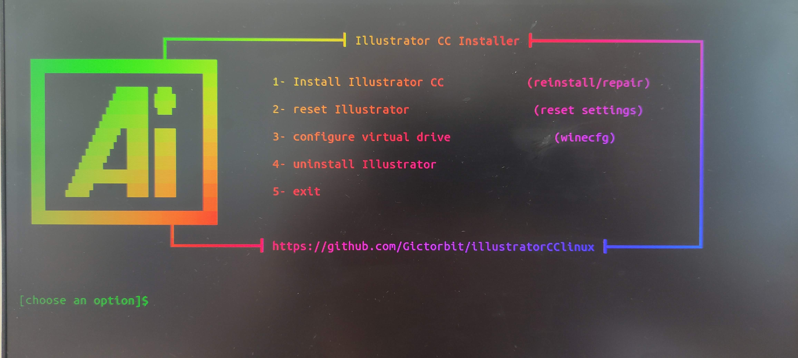

  

# Como instalar Adobe Illustrator no Linux Ubuntu

- Instalar o Wine e Dependencias 

**1. Adicionar o Repositório do Wine:**

sudo dpkg --add-architecture i386

sudo mkdir -pm755 /etc/apt/keyrings

wget -O - https://dl.winehq.org/wine-builds/winehq.key | sudo tee /etc/apt/keyrings/winehq-archive.key

sudo wget -NP /etc/apt/sources.list.d/ https://dl.winehq.org/wine-builds/ubuntu/dists/$(lsb_release -cs)/winehq-$(lsb_release -cs).sources

**2. Instalar Wine:**

sudo apt update

sudo apt install --install-recommends winehq-stable

**3. Instalar Winetricks (Ferramenta para Instalar Componentes Adicionais):**

sudo apt install winetricks

# Passo 2: Configurar o Wine

**1. Configurar o Wine:**

Execute o comando winecfg para abrir a configuração do Wine e faça o seguinte:

    Na aba Applications, defina a versão do Windows para Windows 10.
    Na aba Libraries, adicione as seguintes bibliotecas e defina-as como native, builtin:
        gdiplus
        msxml6
        vcrun2010
        atmlib
        msvcr100
        msvcr120
    Na aba Graphics, marque as opções:
        Emulate a virtual desktop (com uma resolução apropriada, por exemplo, 1920x1080).
        Allow the window manager to decorate the windows.
        Allow the window manager to control the windows.
        
**2. Instalar Componentes Adicionais com o Winetricks:**

Execute os seguintes comandos para instalar componentes adicionais:

winetricks gdiplus

winetricks msxml6

winetricks vcrun2010

winetricks atmlib

winetricks msvcr100

winetricks msvcr120

**3. Instalar o Illustrator**

git clone https://github.com/Gictorbit/illustratorCClinux.git

**Executar o Script de Instalação:**

cd illustratorCClinux

- Torne o script executável:

chmod +x setup.sh

- Execute o script de configuração:

./setup.sh

OPÇÃO 1

Windows 10         OK

PROCESSO CONCLUIDO

